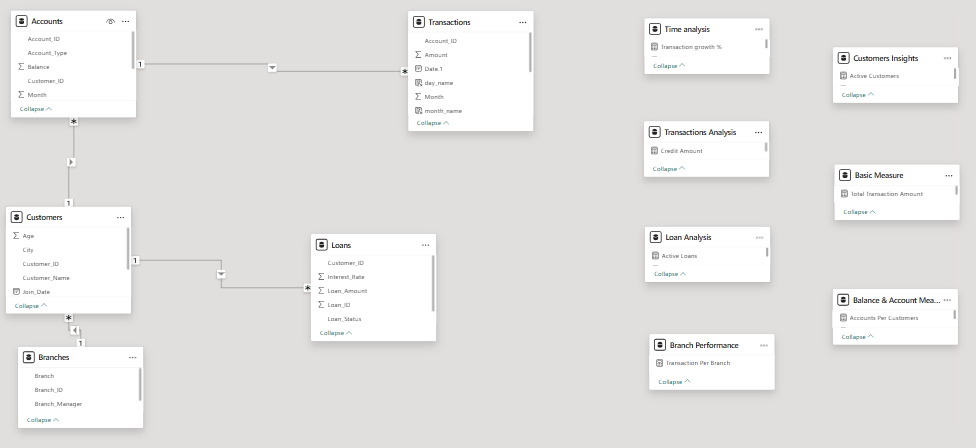
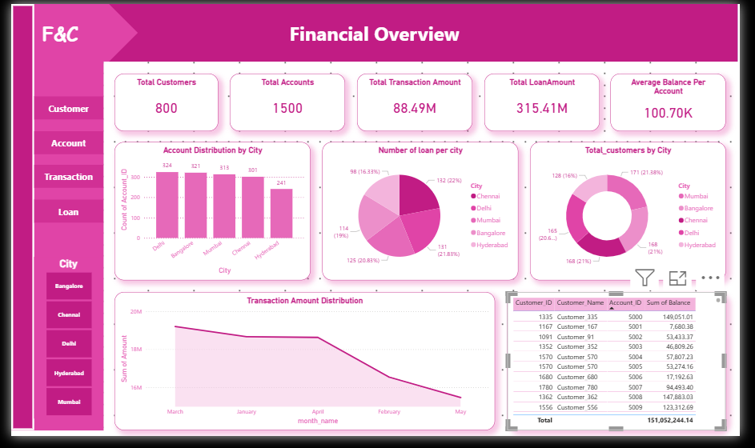
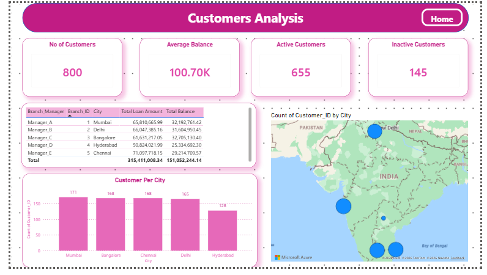
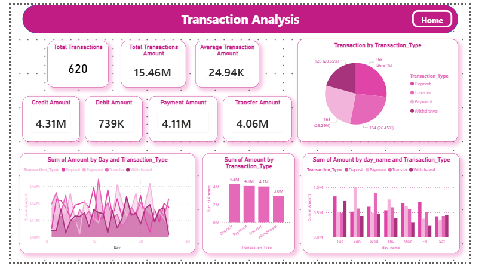
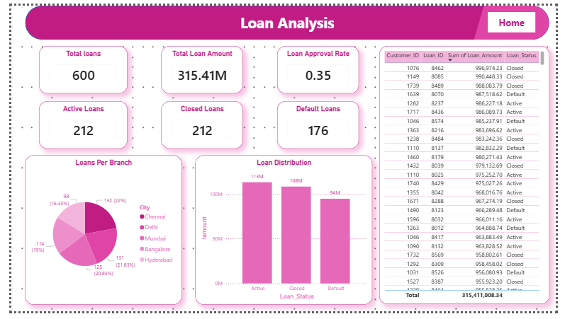

# 🏦 Banking & Financial Analysis Dashboard

<div align="center">


**An interactive Power BI dashboard for comprehensive banking performance analysis — covering customers, transactions, loans, and branch operations.**

</div>

---

## 📌 Table of Contents

- [Overview](#overview)
- [Problem Statement](#problem-statement)
- [Dataset](#dataset)
- [Data Model](#data-model)
- [Tools & Technologies](#tools--technologies)
- [Methods](#methods)
- [Dashboard Pages](#dashboard-pages)
- [Key Insights](#key-insights)
- [How to Run](#how-to-run)
- [Results & Conclusion](#results--conclusion)
- [Future Work](#future-work)
- [Author & Contact](#author--contact)

---

## 📊 Overview

This project presents a multi-page interactive banking dashboard built in **Power BI** using structured relational data across customers, accounts, transactions, loans, and branches.

The dashboard enables banking stakeholders to:

- Monitor overall financial health at a glance
- Analyze transaction flows across time and type
- Track loan portfolios and default risks
- Understand customer distribution and account behavior across cities

The report consists of **4 interactive pages**:

| Page | Description |
|------|-------------|
| 🏠 Financial Overview | Executive-level KPIs and city-wise distributions |
| 👥 Customer Analysis | Customer segmentation, city mapping, branch performance |
| 💳 Transaction Analysis | Transaction trends by type, day, and amount |
| 🏛️ Loan Analysis | Loan status breakdown, distribution, and default tracking |

---

## ❓ Problem Statement

Banks generate enormous volumes of operational data but often struggle to synthesize it into actionable intelligence. This project addresses:

- How are customers, accounts, and loans distributed across cities and branches?
- What is the overall transaction volume and how does it vary by type and time?
- What percentage of the loan portfolio is active, closed, or in default?
- Which branches and managers are driving the most lending and deposits?
- How can stakeholders monitor KPIs in real time through a single dashboard?

---

## 🗃️ Dataset

The project uses **5 core relational tables** stored as CSV files:

| File | Description | Key Fields |
|------|-------------|------------|
| `Customers.csv` | Customer master data | Customer_ID, Customer_Name, City, Age, Join_Date |
| `Accounts.csv` | Bank account details | Account_ID, Account_Type, Balance, Customer_ID, Month |
| `Transactions.csv` | Transaction records | Account_ID, Amount, Date, Transaction_Type, Day, Month |
| `Loans.csv` | Loan portfolio data | Loan_ID, Customer_ID, Loan_Amount, Interest_Rate, Loan_Status |
| `Branches.csv` | Branch information | Branch_ID, Branch, Branch_Manager |

### Summary Statistics

| Metric | Value |
|--------|-------|
| Total Customers | 800 |
| Total Accounts | 1,500 |
| Total Transaction Amount | 88.49M |
| Total Loan Amount | 315.41M |
| Average Balance Per Account | 100.70K |

---

## 🗺️ Data Model

The data model follows a **Star/Snowflake hybrid schema** with Customers as the central entity:

```
Customers ──(1:*)── Accounts ──(1:*)── Transactions
    │
    └──(1:*)── Loans
    │
    └──(*:1)── Branches
```

**Measure Tables (DAX):**
- `Time Analysis` — Transaction growth %
- `Transactions Analysis` — Credit Amount
- `Loan Analysis` — Active Loans
- `Branch Performance` — Transaction Per Branch
- `Customers Insights` — Active Customers
- `Basic Measure` — Total Transaction Amount
- `Balance & Account Measures` — Accounts Per Customer



---

## 🛠️ Tools & Technologies

| Category | Tools |
|----------|-------|
| **Data Storage** | CSV, Excel (.xlsx) |
| **Data Visualization** | Power BI Desktop, Power BI Service |
| **Data Modeling** | Star/Snowflake Schema |
| **Query & Transformation** | Power Query (M Language) |
| **Calculations** | DAX (Data Analysis Expressions) |
| **Mapping** | Microsoft Azure Maps |

---

## ⚙️ Methods

### 1. Data Ingestion
- Loaded CSV files into Power BI via Power Query
- Established relationships across all 5 tables

### 2. Data Cleaning
- Removed duplicate records
- Handled null/missing values
- Standardized date formats and city names
- Validated referential integrity between tables

### 3. Data Modeling
- Built relationships: Customers → Accounts → Transactions, Customers → Loans, Customers → Branches
- Created separate DAX measure tables for logical organization

### 4. DAX Measures Created

```dax
-- Example Measures
Total Customers = DISTINCTCOUNT(Customers[Customer_ID])
Active Customers = CALCULATE(COUNTROWS(Customers), Customers[Status] = "Active")
Total Loan Amount = SUM(Loans[Loan_Amount])
Loan Approval Rate = DIVIDE([Active Loans], [Total Loans])
Total Transaction Amount = SUM(Transactions[Amount])
Credit Amount = CALCULATE(SUM(Transactions[Amount]), Transactions[Transaction_Type] = "Deposit")
```

### 5. Dashboard Development
Built using:
- KPI Cards, Bar & Pie Charts, Line Charts
- Matrix Tables, Map Visuals (Azure Maps)
- Slicers (City filter), Page Navigation buttons

---

## 📋 Dashboard Pages

### Page 1: Financial Overview

> Executive summary of all key banking metrics

**KPIs:** Total Customers · Total Accounts · Total Transaction Amount · Total Loan Amount · Average Balance Per Account

**Visuals:**
- Account Distribution by City (Bar Chart)
- Number of Loans Per City (Pie Chart)
- Total Customers by City (Donut Chart)
- Transaction Amount Distribution Over Time (Line Chart)
- Account Balance Table by Customer



---

### Page 2: Customer Analysis

> Deep-dive into customer demographics, city distribution, and branch performance

**KPIs:** No. of Customers · Average Balance · Active Customers · Inactive Customers

**Visuals:**
- Branch Manager Performance Table (Loan Amount + Balance)
- Customer Per City (Bar Chart)
- Count of Customers by City (Azure Map)



---

### Page 3: Transaction Analysis

> Full breakdown of transaction flows by type, day, and time

**KPIs:** Total Transactions · Total Transaction Amount · Average Transaction Amount · Credit Amount · Debit Amount · Payment Amount · Transfer Amount

**Visuals:**
- Transaction by Type — Deposit, Transfer, Payment, Withdrawal (Pie Chart)
- Sum of Amount by Day and Transaction Type (Line Chart)
- Sum of Amount by Transaction Type (Bar Chart)
- Sum of Amount by Day Name and Transaction Type (Grouped Bar Chart)



---

### Page 4: Loan Analysis

> Portfolio health tracking — active, closed, and defaulted loans

**KPIs:** Total Loans · Total Loan Amount · Loan Approval Rate · Active Loans · Closed Loans · Default Loans

**Visuals:**
- Loans Per Branch / City (Pie Chart)
- Loan Distribution by Status (Bar Chart)
- Customer Loan Detail Table (Loan ID, Amount, Status)



---

## 💡 Key Insights

### Customer Insights
- **800 total customers** distributed evenly across 5 cities: Mumbai (171), Bangalore (168), Chennai (168), Delhi (165), Hyderabad (128)
- **655 active customers** vs **145 inactive** — 81.9% active rate
- Average account balance of **₹1,00,700** per account

### Transaction Insights
- **620 total transactions** worth **₹88.49M**
- Deposits dominate transaction volume; transfers and payments follow closely
- Transaction activity is relatively consistent across weekdays, with slight peaks

### Loan Insights
- **600 total loans** totaling **₹315.41M**
- Portfolio split: **212 Active**, **212 Closed**, **176 Default**
- Default rate of **~29.3%** — a key risk metric to monitor
- Chennai and Delhi branches lead in loan origination

### Branch Insights
- **Manager B (Delhi)** handles the highest total balance at ₹31.6M
- **Manager A (Mumbai)** leads in loan origination at ₹65.8M total loan amount

---

## 🚀 How to Run

### Prerequisites
- Power BI Desktop (latest version)
- The 5 CSV data files in the `/data` folder

### Steps

```bash
# 1. Clone the repository
git clone https://github.com/your-username/banking-financial-analysis

# 2. Open the Power BI file
# Navigate to the project folder and open:
Banking_Financial_Analysis.pbix
```

3. In Power BI Desktop, go to **Transform Data → Data Source Settings**
4. Update the file paths to point to your local `/data` CSV folder
5. Click **Refresh** to reload all data
6. Explore all 4 dashboard pages using the left navigation panel and city slicers

---

## 📈 Results & Conclusion

The dashboard transforms raw banking data into a centralized decision-support system.

**Key Outcomes:**
- Unified view of 800 customers, 1,500 accounts, 600 loans, and 620 transactions
- Real-time KPI monitoring across all business dimensions
- Loan default identification for risk management
- Branch and city-level performance benchmarking
- Customer activity segmentation for targeted engagement

---

## 🔮 Future Work

- [ ] **Loan Default Prediction** using Machine Learning (Python + Azure ML)
- [ ] **Customer Churn Analysis** with behavioral scoring
- [ ] **Customer Lifetime Value (CLV)** modeling
- [ ] **Automated Data Refresh** via Power BI Gateway
- [ ] **Real-Time Transaction Monitoring** with streaming datasets
- [ ] **SQL Server / Azure SQL** backend integration for scalability
- [ ] **Mobile-Optimized** Power BI layout

---

## 👤 Author & Contact

### Harshal Patil
**Role:** Data Analyst

| Skill | Proficiency |
|-------|-------------|
| Power BI | ⭐⭐⭐⭐⭐ |
| SQL | ⭐⭐⭐⭐⭐ |
| Python | ⭐⭐⭐⭐ |
| Advanced Excel | ⭐⭐⭐⭐⭐ |
| DAX | ⭐⭐⭐⭐ |
| AWS (S3, RDS, Redshift, Athena) | ⭐⭐⭐ |
| Data Modeling | ⭐⭐⭐⭐⭐ |

[](https://github.com/harsh-8830)
[](https://linkedin.com/in/harshal-patil-6b7207359)

---

<div align="center">

⭐ **If you found this project helpful, please give it a star!** ⭐

</div>
